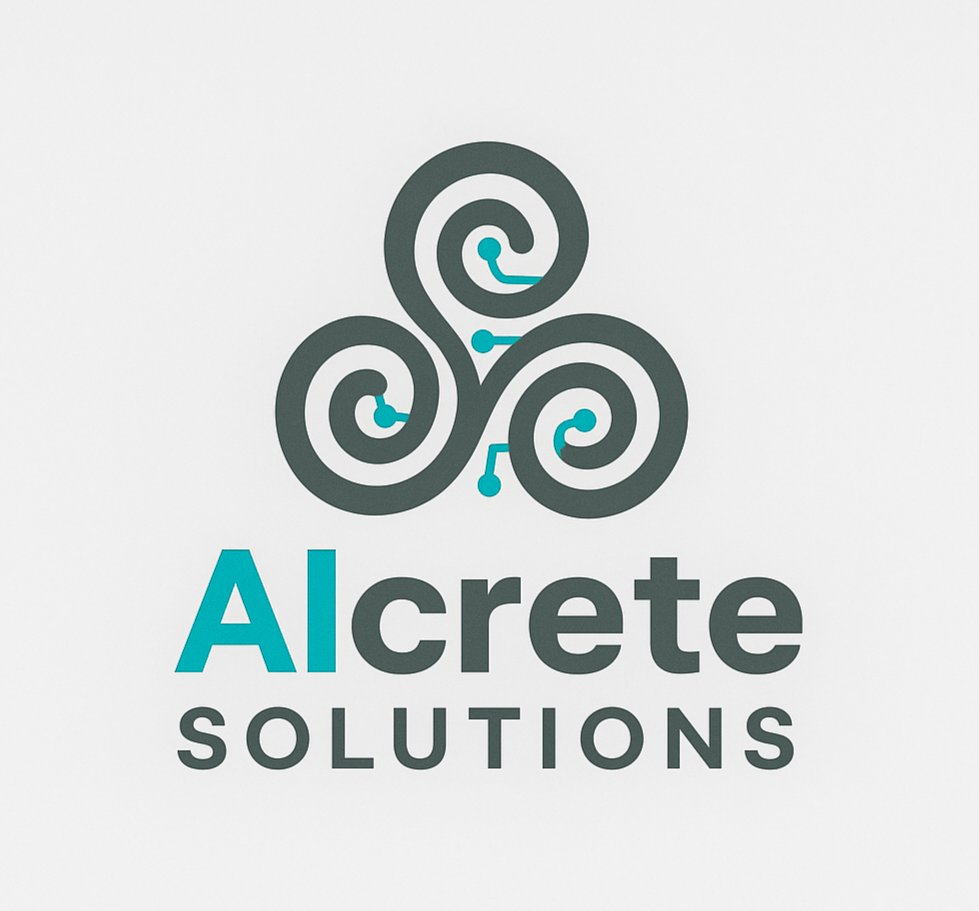

# 🏗️ AIcrete Solutions - UHPC Analysis Platform

<div align="center">



**AI-powered Ultra-High Performance Concrete analysis platform for professional engineers**

[](https://streamlit.io/)
[](https://python.org/)
[](LICENSE)
[](https://your-app-url.streamlit.app)

</div>

## 🚀 **Platform Overview**

AIcrete Solutions revolutionizes Ultra-High Performance Concrete (UHPC) analysis and design with cutting-edge AI technology. Transform weeks of laboratory testing into seconds of intelligent predictions with our professional-grade platform.

### ✨ **Latest Features (v2.0)**

- 🎨 **Professional Interface**: New AIcrete Solutions branding with stunning futuristic city background
- 🔮 **Instant Property Prediction**: 5 critical properties in under 2 seconds
- 🎯 **AI-Optimized Mix Design**: Target-based design with constraint handling
- 📊 **Advanced Model Validation**: Comprehensive overfitting analysis and performance metrics
- 💰 **Multi-Currency Cost Analysis**: Support for GBP/USD/EUR with real-time optimization
- 📄 **Professional Reports**: Engineering-grade PDF and HTML documentation
- 🌐 **Standards Compliance**: Built for professional engineering workflows
- 🔍 **Interactive Analytics**: Real-time correlation analysis and sensitivity studies

## 🌟 **Visual Excellence**

- **Professional Logo**: AIcrete Solutions three-spiral design representing innovation and flow
- **Stunning Background**: Futuristic smart city backdrop with optimal fade for readability
- **Purple Progress Bars**: Professional color scheme indicating smooth operation
- **Glass Morphism UI**: Semi-transparent containers with backdrop blur effects
- **Responsive Design**: Optimized for all screen sizes and devices

## 📊 **Predicted Properties**

| Property | Range | Units | Application |
|----------|--------|-------|-------------|
| Compressive Strength | 50-250 | MPa | Structural design |
| Tensile Strength | 3-15 | MPa | Crack resistance |
| Elastic Modulus | 30-60 | GPa | Deformation analysis |
| UPV | 3500-5500 | m/s | Quality assessment |
| Cost | 400-1500 | £/€/$/m³ | Economic optimization |

## 🚀 **Quick Deployment**

### **🌟 Deploy on Streamlit Cloud (Recommended)**
1. **Fork/Upload** this repository to GitHub
2. **Visit** [share.streamlit.io](https://share.streamlit.io)
3. **Connect** your GitHub account
4. **Deploy** with `aicrete_app.py` as the main file
5. **Launch** - Your platform will be live in 2-3 minutes!

### **📁 Repository Structure**
```
aicrete-platform/
├── aicrete_app.py              # Main application file
├── logo_aicrete.png            # Professional AIcrete Solutions logo
├── aicrete_background.png      # Futuristic city background
├── requirements.txt            # Python dependencies
├── overfitting_analysis.py     # ML validation module
├── README.md                  # This documentation
├── .streamlit/                # Streamlit configuration
│   └── config.toml           # App configuration
└── outputs/                   # Generated reports directory
```

### **💻 Local Installation**
```bash
# Clone the repository
git clone https://github.com/yourusername/aicrete-platform.git
cd aicrete-platform

# Install dependencies
pip install -r requirements.txt

# Run the application
streamlit run aicrete_app.py
```

### **🐳 Docker Deployment**
```bash
# Build and run with Docker
docker build -t aicrete-app .
docker run -p 8501:8501 aicrete-app

# Or use Docker Compose
docker-compose up -d
```

## 🎯 **Use Cases**

### **For Structural Engineers**
- Preliminary design optimization
- Performance specification verification
- Cost-effective mix selection
- Multi-objective design solutions

### **For Researchers**
- Parameter sensitivity studies
- Material behavior analysis
- Correlation investigations
- Optimization research

### **For Project Managers**
- Cost estimation and budgeting
- Timeline optimization
- Resource planning
- Risk assessment

## 🛠️ **Technology Stack**

- **Frontend**: Streamlit
- **Backend**: Python 3.9+
- **ML/AI**: Scikit-learn, NumPy
- **Visualization**: Plotly, Matplotlib
- **Documentation**: ReportLab
- **Data Processing**: Pandas

## 📱 **Professional Interface**

### **🏗️ 12-Tab Professional Platform**

| Tab | Feature | Description |
|-----|---------|-------------|
| 1️⃣ | **Property Prediction** | Instant 5-property predictions with professional insights |
| 2️⃣ | **Target-Based Design** | AI-optimized mix design for specific performance targets |
| 3️⃣ | **Interactive Analytics** | Real-time correlation analysis and sensitivity studies |
| 4️⃣ | **Cost vs Performance** | Multi-objective optimization with economic analysis |
| 5️⃣ | **Application Templates** | Industry-specific presets for common applications |
| 6️⃣ | **Optimization Engine** | Advanced AI-driven parameter optimization |
| 7️⃣ | **Professional Reports** | Engineering-grade PDF and HTML documentation |
| 8️⃣ | **Project Management** | Save, load, and manage multiple projects |
| 9️⃣ | **Model Validation** | Comprehensive overfitting analysis and performance metrics |
| 🔟 | **Sustainability Analysis** | Environmental impact assessment and green metrics |
| 1️⃣1️⃣ | **Standards Compliance** | British Standards integration and compliance checking |
| 1️⃣2️⃣ | **User Guide** | Comprehensive help and documentation |

### **✨ Professional Features**
- **Header Logo**: AIcrete Solutions branding with professional three-spiral design
- **Sidebar Navigation**: Streamlined access to all platform features
- **Real-time Feedback**: Purple progress bars and instant status updates
- **Professional Disclaimers**: Engineering decision support guidelines
- **Responsive Design**: Optimized for desktop and mobile devices

## 📊 **Performance Benefits**

| Traditional Approach | AIcrete Solution | Improvement |
|----------------------|------------------|-------------|
| Weeks of testing | Seconds of prediction | 99% time savings |
| £1000s per iteration | Unlimited virtual tests | 90% cost reduction |
| Limited variations | Infinite possibilities | Unlimited exploration |
| Trial and error | Data-driven optimization | Consistent accuracy |

## 🔧 **Configuration**

### **Environment Setup**
- Python 3.9+ required
- Dependencies in `requirements.txt`
- Streamlit config in `.streamlit/config.toml`

### **Deployment Options**
- **Streamlit Cloud**: Zero-config deployment
- **Heroku**: `Procfile` and `setup.sh` included
- **Docker**: `Dockerfile` and `docker-compose.yml` ready
- **Local**: Standard pip installation

## 📚 **Documentation**

- 📖 [`USER_GUIDE.md`](USER_GUIDE.md) - Comprehensive user manual
- 🚀 [`DEPLOYMENT_GUIDE.md`](DEPLOYMENT_GUIDE.md) - Detailed deployment instructions
- ⚡ [`DEPLOYMENT_QUICK_START.md`](DEPLOYMENT_QUICK_START.md) - Quick deployment guide
- 📱 [`LINKEDIN_PROMOTION_KIT.md`](LINKEDIN_PROMOTION_KIT.md) - Marketing materials
- ✅ [`GITHUB_UPLOAD_CHECKLIST.md`](GITHUB_UPLOAD_CHECKLIST.md) - Upload verification

## 🌟 **Professional Features**

### **Engineering Standards**
- Professional Engineer workflow integration
- British Standards compliance checking
- Quality control protocols
- Industry best practices

### **Advanced Analytics**
- Parameter correlation analysis
- Sensitivity studies
- Pareto frontier optimization
- SHAP AI interpretability

### **Professional Output**
- Engineering-grade reports
- Technical documentation
- Project management tools
- Multi-currency cost analysis

## 📞 **Support & Contact**

- **Issues**: GitHub Issues
- **Documentation**: Built-in user guide
- **Professional Inquiries**: [Your Contact Information]
- **LinkedIn**: [Your LinkedIn Profile]

## 🤝 **Contributing**

We welcome contributions! Please see our contribution guidelines and feel free to submit issues or pull requests.

## 📄 **Copyright & License**

**Copyright © 2025 Shiksha Seechurn. All rights reserved.**

This software is the intellectual property of Shiksha Seechurn, developed as part of advanced research at the University of Hertfordshire. 

### **Usage Rights**
- ✅ **Educational Use**: Academic and research use permitted with proper citation
- ✅ **Portfolio Display**: Showcase for professional development
- ❌ **Commercial Use**: Requires explicit written permission
- ❌ **Redistribution**: Unauthorized copying or distribution prohibited

### **Author Information**
- **Author**: Shiksha Seechurn
- **Institution**: University of Hertfordshire
- **Project**: MSc Final Year Project - AI-Powered UHPC Analysis Platform
- **Year**: 2025

### **Citation Requirements**
If you use this software in academic work, please cite:
```
Seechurn, S. (2025). AIcrete: AI-Powered UHPC Analysis Platform. 
University of Hertfordshire. https://github.com/yourusername/aicrete-uhpc-platform
```

This project is licensed under the MIT License with additional academic use terms - see the [LICENSE](LICENSE) file for details.

## 🏆 **Recognition**

Built as part of advanced materials engineering research at the University of Hertfordshire, combining academic rigor with practical engineering applications.

---

**🚀 Ready to revolutionize your concrete projects? Deploy AIcrete today!**

[](https://share.streamlit.io)
[](https://hub.docker.com)
[](https://heroku.com)
